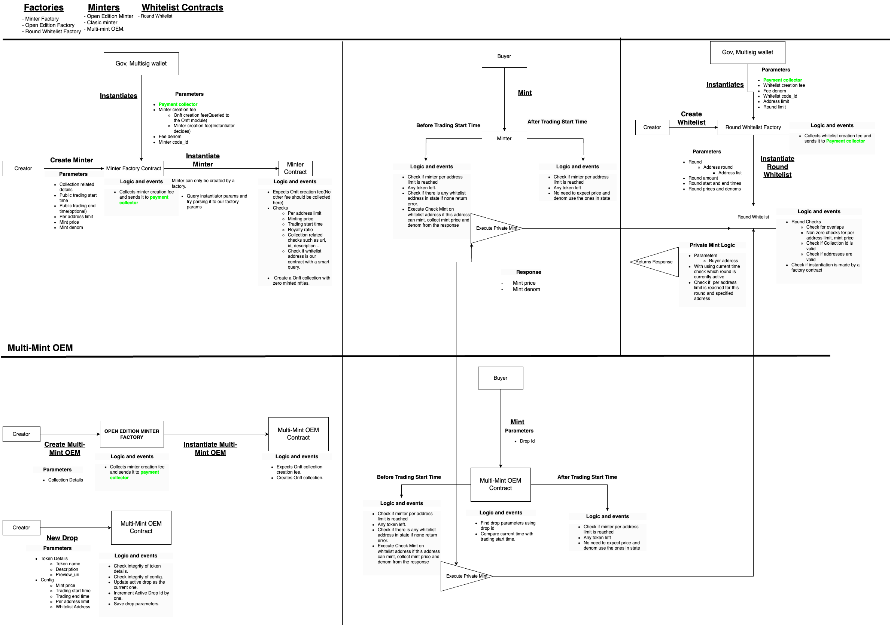

# Omniflix Launchpad 

## Omniflix Launchpad Contracts

This repository hosts the smart contracts for the OmniFlix launchpad. These contracts empower creators to launch an NFT collection. After setting these up, creators can share the details with their community or users, enabling them to mint an NFT.

## Factories

Launchpad utilizes a singleton structure for each collection that is released through this launchpad. The purpose of the factories is to create an instance of minters and whitelist contracts.

## Design


## Build
To build the contracts, use the following command:

```cargo build```

## Testing
Testing is done using multi-test package. To run the tests, use the following command:

```cargo test```


## Optimizations
To optimize the contract and generate the wasm file, run the following command:

```
docker run --rm -v "$(pwd)":/code \
  --mount type=volume,source="$(basename "$(pwd)")_cache",target=/target \
  --mount type=volume,source=registry_cache,target=/usr/local/cargo/registry \
  cosmwasm/workspace-optimizer:0.13.0
```